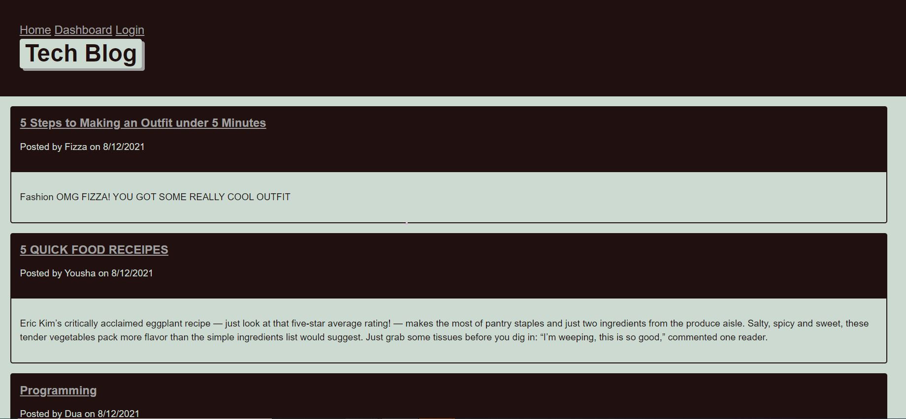

<h1 align="center">Model-View-Controller (MVC) Challenge: Tech Blog 👋</h1>
  

    
    
    
    
    
    

  

    
    
    
    
    

   
<h4>Designed and coded by <a href="https://github.com/fizzaaz">FIZZA ZAIDI</a></h4>## Description 

## Description

🔍Developers spend plenty of time creating new applications and debugging existing codebases, but most developers also spend at least some of their time reading and writing about technical concepts, recent advancements, and new technologies. I have build a CMS-style blog site similar to a Wordpress site, where developers can publish their blog posts and comment on other developers’ posts as well. This app follows the MVC paradigm in its architectural structure, using Handlebars.js as the templating language, Sequelize as the ORM, and the express-session npm package for authentication.

✋ [GitHub Repository](https://github.com/fizzaaz/Tech-Blog)

✋ [Deployed Application URL](https://techbloghero.herokuapp.com/)

## ✋User Requirements
User WANT a CMS-style blog site SO THAT the user can publish articles, blog posts, and my thoughts and opinions.

## ✋Project Requirements

* WHEN I visit the site for the first time THEN I am presented with the homepage, which includes existing blog posts if any have been posted; navigation links for the homepage and the dashboard; and the option to log in
* WHEN I click on the homepage option THEN I am taken to the homepage
* WHEN I click on any other links in the navigation THEN I am prompted to either sign up or sign in
* WHEN I choose to sign up THEN I am prompted to create a username and password
* WHEN I click on the sign-up button THEN my user credentials are saved and I am logged into the site
* WHEN I revisit the site at a later time and choose to sign in THEN I am prompted to enter my username and password
* WHEN I am signed in to the site THEN I see navigation links for the homepage, the dashboard, and the option to log out
* WHEN I click on the homepage option in the navigation THEN I am taken to the homepage and presented with existing blog posts that include the post title and the date created
* WHEN I click on an existing blog post THEN I am presented with the post title, contents, post creator’s username, and date created for that post and have the option to leave a comment
* WHEN I enter a comment and click on the submit button while signed in THEN the comment is saved and the post is updated to display the comment, the comment creator’s username, and the date created
* WHEN I click on the dashboard option in the navigation THEN I am taken to the dashboard and presented with any blog posts I have already created and the option to add a new blog post
* WHEN I click on the button to add a new blog post THEN I am prompted to enter both a title and contents for my blog post
* WHEN I click on the button to create a new blog post THEN the title and contents of my post are saved and I am taken back to an updated dashboard with my new blog post
* WHEN I click on one of my existing posts in the dashboard THEN I am able to delete or update my post and taken back to an updated dashboard
* WHEN I click on the logout option in the navigation THEN I am signed out of the site
* WHEN I am idle on the site for more than a set time THEN I am able to view comments but I am prompted to log in again before I can add, update, or delete comments

## Table of Contents
- [Description](#description)
- [User Requirements](#user-requirements)
- [Project Requirements](#project-requirements)
- [Installation](#installation)
- [Usage](#usage)
- [Testing](#testing)
- [Contribution](#contribution)
- [Questions](#questions)

## 💻Usage
  
Run the following command at the root of your project and answer the prompted questions:

`mysql -u root -p`

Enter PW when promted

`source db/schema.sql`

`quit`

`npm run seed`
  
`npm start`     

## 💾Installation

`npm init`

`npm install mysql2`

`npm install sequelize`

`npm install dotenv`

## ✏️Testing

No testing is currently set up

## 👪Contribution

  Email me 

## Questions

 If you have any queries feel free to contact me at ✉️ fizz.zehra14@gmail.com.
 You can also reach me out through my Github profile at  👋[fizzaaz](https://github.com/fizzaaz/).

